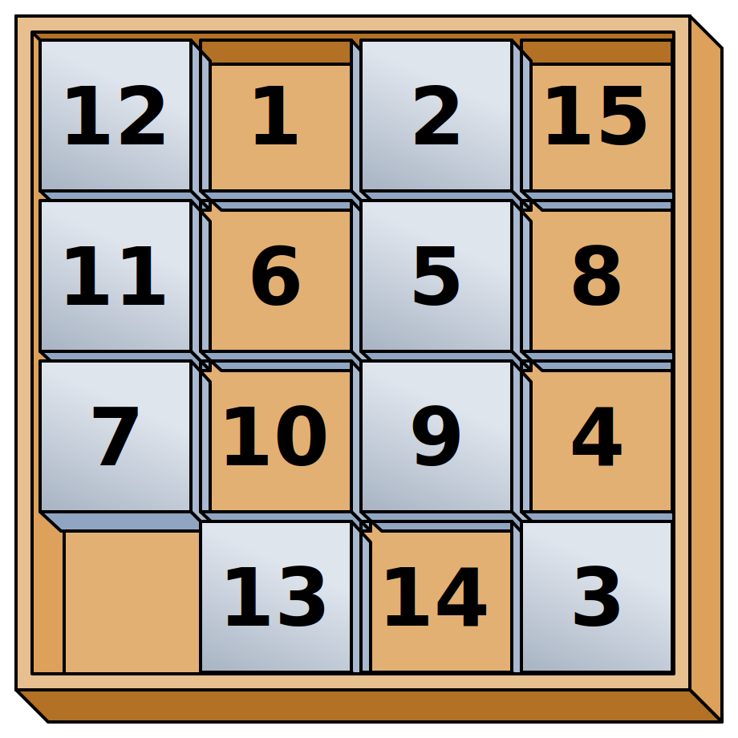
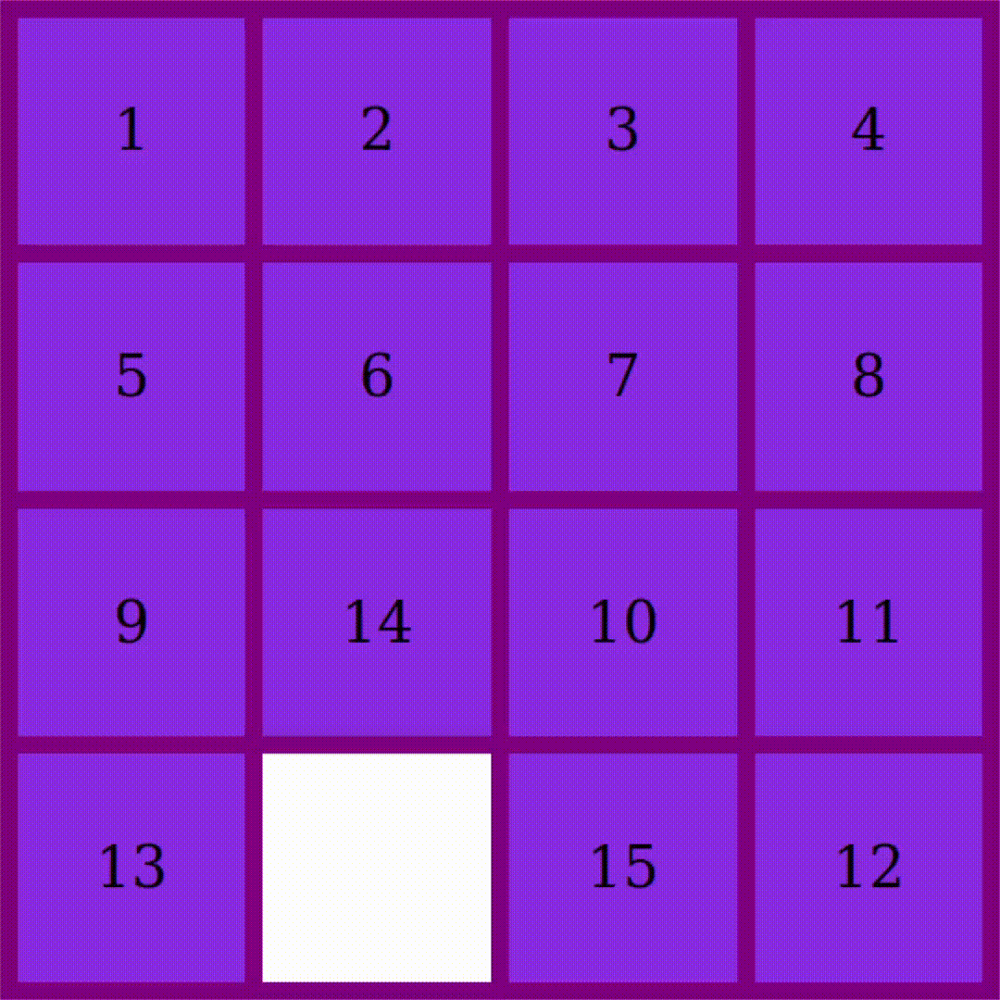

# 15-Puzzle

 
    The 15 puzzle is a sliding puzzle having 15 square tiles numbered 1–15 in a frame that is 4 tiles high and 4 tiles wide, leaving one unoccupied tile position. Tiles in the same row or column of the open position can be moved by sliding them horizontally or vertically, respectively. The goal of the puzzle is to place the tiles in numerical order.

[Read More](https://en.wikipedia.org/wiki/15_puzzle)

## How to Play
### 1: Enter Your Name

### 2: Click a tile next to the empty one to swap their positions

### 3: Place the tiles in order to win!
